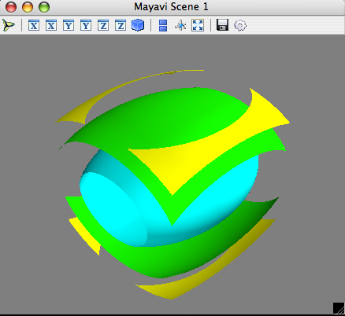
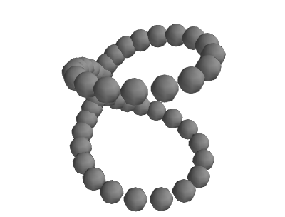
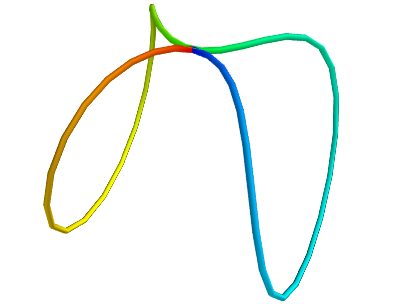
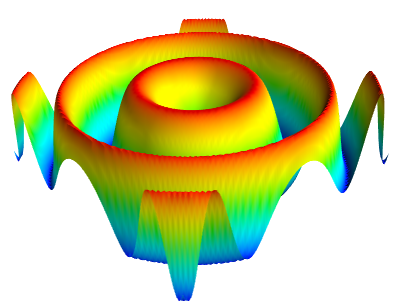
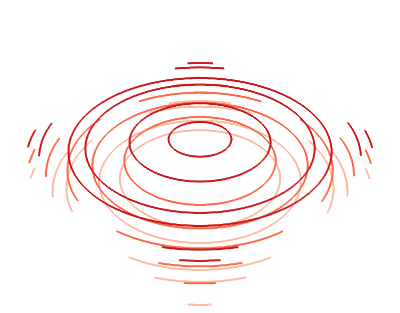
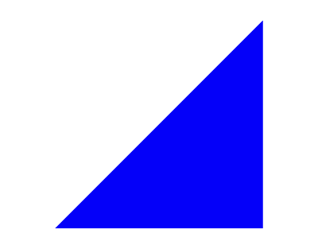
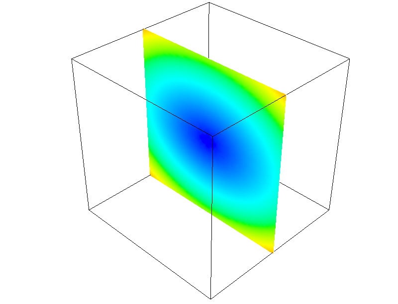
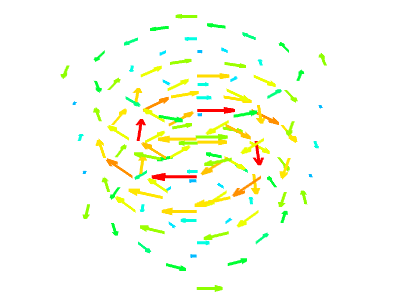

---
jupyter:
  jupytext:
    text_representation:
      extension: .md
      format_name: markdown
      format_version: '1.3'
      jupytext_version: 1.13.7
  kernelspec:
    display_name: Python 3 (ipykernel)
    language: python
    name: python3
---

<!-- #region slideshow={"slide_type": "slide"} -->
## Mayavi basics

**Prabhu Ramachandran and Matt McCormick**

**SciPy 2022**

<!-- #endregion -->

<!-- #region slideshow={"slide_type": "slide"} -->
## Getting started with `mlab`

<!-- #endregion -->

<!-- #region slideshow={"slide_type": "slide"} -->
## Overview

* Simple

* Convenient

* Full-featured

<!-- #endregion -->

<!-- #region slideshow={"slide_type": "slide"} -->
## Getting started

With `jupyter`,

```
$ jupyter console
In [1]: %gui qt
```

with IPython,

```
$ ipython --gui=qt
```

or

```
$ ipython
In [1]: %gui qt
```

<!-- #endregion -->

<!-- #region slideshow={"slide_type": "slide"} -->
## Using notebooks

Make sure you have the following code first

<!-- #endregion -->

```python
%gui qt
```

* All plots will pop-up a window

* Inline support will be covered later


<!-- #region slideshow={"slide_type": "slide"} -->
## Troubleshooting

* Which version of Python?

* Version of VTK?

* Version of Qt?

* Post on chat

<!-- #endregion -->

<!-- #region slideshow={"slide_type": "slide"} -->
## Using `mlab`

<!-- #endregion -->

```python
from mayavi import mlab
```


Try these


```python
mlab.test_<TAB>
```

```python slideshow={"slide_type": "fragment"}
mlab.test_contour3d()
```

```python
mlab.test_contour3d??
```

<!-- #region slideshow={"slide_type": "slide"} -->
## Exploring the view



* Mouse
* Keyboard
* Toolbar
* Mayavi icon 

<!-- #endregion -->

<!-- #region slideshow={"slide_type": "slide"} -->
## Using `mlab`: the basics

<!-- #endregion -->

<!-- #region slideshow={"slide_type": "slide"} -->
## `mlab` plotting functions: 0D data


<!-- #endregion -->

```python
import numpy as np
from numpy import *
```

```python
t = linspace(0, 2*pi, 50)
u = cos(t)*pi
x, y, z = sin(u), cos(u), sin(t)
```

```python
mlab.points3d(x, y, z)
```

<!-- #region slideshow={"slide_type": "slide"} -->
## Changing how things look

### Clearing the view

<!-- #endregion -->

```python
mlab.clf()
```

### IPython is your friend!


```python
mlab.points3d?
```

<!-- #region slideshow={"slide_type": "fragment"} -->

* Extra argument: Scalars
* Keyword arguments
* UI

<!-- #endregion -->

```python slideshow={"slide_type": "fragment"}
mlab.points3d(x, y, z, t, scale_mode='none')
```

<!-- #region slideshow={"slide_type": "slide"} -->
### 1D data



<!-- #endregion -->

```python
mlab.clf()
mlab.plot3d(x, y, z, t)
```

Plots lines between the points


<!-- #region slideshow={"slide_type": "slide"} -->
## 2D data: `mlab.surf`


<!-- #endregion -->

```python
x, y = mgrid[-3:3:100j,-3:3:100j]
z = sin(x*x + y*y)
```

```python
mlab.clf()
mlab.surf(x, y, z)
```

Assumes the points are rectilinear


<!-- #region slideshow={"slide_type": "slide"} -->
## 2D data: `mlab.contour_surf`



<!-- #endregion -->

```python
x, y = mgrid[-3:3:100j,-3:3:100j]
z = sin(x*x + y*y)
```

```python
mlab.clf()
mlab.contour_surf(x, y, z)
```

Assumes the points are rectilinear


<!-- #region slideshow={"slide_type": "slide"} -->
## 2D data: `mlab.mesh`

<!-- #endregion -->

```python
mlab.clf()
mlab.mesh(x, y, z)
```


**Points need not be regular**


```python slideshow={"slide_type": "fragment"}
x, y = mgrid[-3:3:100j,-3:3:100j]
z = (x*x + y*y)*0.1
mlab.clf()
mlab.mesh(sin(x), cos(y), z)
```

<!-- #region slideshow={"slide_type": "fragment"} -->
Go ahead and experiment with other functions!

<!-- #endregion -->

```python
mlab.clf()
mlab.mesh(sin(x), cos(y), sin(x*y))
```

<!-- #region slideshow={"slide_type": "slide"} -->
## Exercise

Plot the surface of a unit sphere using `mlab.mesh` with a wireframe.

<!-- #endregion -->

<!-- #region slideshow={"slide_type": "fragment"} -->
Hint: recall spherical polar to Cartesians,

$x = r \sin(\theta) \cos(\phi)$

$y = r \sin(\theta) \sin(\phi)$

$z = r \cos(\theta)$

<!-- #endregion -->

<!-- #region slideshow={"slide_type": "slide"} -->
## Solution

<!-- #endregion -->

```python
# Solution code
```

```python
%load -r 5-10 solutions/01_sphere.py
```

<!-- #region slideshow={"slide_type": "slide"} -->
## 2D data: `mlab.triangular_mesh`



<!-- #endregion -->

```python
x, y, z = [[0., 1., 1], [0., 0, 1], [0., 0, 0]]
t = [[0, 1, 2]]
```

```python
points = np.array([[0., 0, 0], [1, 0, 0], [1, 1, 0]])
x, y, z = points.T
```

```python
mlab.clf()
mlab.triangular_mesh(x, y, z, t)
```

Explicitly specify the triangles


<!-- #region slideshow={"slide_type": "slide"} -->
## Exercise (Optional)

Create a simple pyramid composed of triangles and plot it.

<!-- #endregion -->

<!-- #region slideshow={"slide_type": "slide"} -->
## Solution

<!-- #endregion -->

```python
# Solution...
```

```python
%load solutions/02_pyramid.py
```

<!-- #region slideshow={"slide_type": "slide"} -->
## 2D data: `mlab.imshow`

<!-- #endregion -->

```python
s = np.random.random((2<<12, 2<<12))
s.shape
```

```python
mlab.clf()
mlab.imshow(s)
```

Do not try this with `matplotlib`!


<!-- #region slideshow={"slide_type": "slide"} -->
## 3D data


<!-- #endregion -->

```python
x, y, z = mgrid[-5:5:64j, -5:5:64j, -5:5:64j]
mlab.clf()
mlab.contour3d(x*x*0.5 + y*y + z*z*2)
```

<!-- #region slideshow={"slide_type": "slide"} -->
## 3D data: `volume_slice`



<!-- #endregion -->

```python
x, y, z = np.mgrid[-5:5:64j, -5:5:64j, -5:5:64j]
mlab.clf()
mlab.volume_slice(x, y, z, x*x*0.5 + y*y + z*z*2)
```

<!-- #region slideshow={"slide_type": "slide"} -->
## 3D vector data: `mlab.quiver3d`



<!-- #endregion -->

```python
mlab.clf()
mlab.test_quiver3d()
```

```python
#o = mlab.quiver3d(x, y, z, u, v, w)
o = mlab.quiver3d(1, 1, 1, 0, 5, 5)
```

<!-- #region slideshow={"slide_type": "slide"} -->
## 3D vector data: `mlab.flow`

<!-- #endregion -->

```python
x, y, z = mgrid[-2:3:10j, -2:3:10j, -2:3:10j]
r = sqrt(x**2 + y**2 + z**4)
u = y*sin(r)/(r+0.001)
v = -x*sin(r)/(r+0.001)
w = ones_like(z)*0.1
mlab.clf()
obj = mlab.flow(x, y, z, u, v, w,
                seedtype='plane')
```

<!-- #region slideshow={"slide_type": "slide"} -->
## Exercise: Lorenz equation

\begin{align}
\frac{d x}{dt} &= s (y-x) \\
\frac{d y}{d t} &= rx -y -xz \\
\frac{d z}{d t} &= xy - bz \\
\end{align}

Let $ s=10,r=28, b=8./3$.

<!-- #endregion -->

```python
x, y, z = mgrid[-50:50:20j, -50:50:20j, -10:60:20j]
```

<!-- #region slideshow={"slide_type": "slide"} -->
## Exercise

* Hint: use `mlab.quiver3d`
* Explore arguments to make the visualization better


<!-- #region slideshow={"slide_type": "slide"} -->
## Solution

<!-- #endregion -->

```python
def lorenz(x, y, z, s=10.,r=28., b=8./3):
    u = s*(y-x)
    v = r*x -y - x*z
    w = x*y - b*z
    return u, v, w
```

```python
x, y, z = mgrid[-50:50:20j,-50:50:20j, -10:60:20j]
# Solution here ....
```

```python
%load solutions/02_lorenz.py
```

<!-- #region slideshow={"slide_type": "slide"} -->
## Another exercise

* Try the same with `mlab.flow`
* Use the UI to configure things

<!-- #endregion -->

<!-- #region slideshow={"slide_type": "slide"} -->
## Solution

<!-- #endregion -->

```python
mlab.clf()
mlab.flow(x, y, z, u, v, w)
```


<!-- #region slideshow={"slide_type": "slide"} -->
## Tips

* Basic visualization: not very useful

* Tweak parameters: `mask_points, scale_factor`
* Explore parameters on UI

* `mlab.flow`  is a lot better!

**Good visualization involves work**

<!-- #endregion -->

<!-- #region slideshow={"slide_type": "slide"} -->
## Other utility functions

* `gcf` : get current figure

<!-- #endregion -->

<!-- #region slideshow={"slide_type": "fragment"} -->

* `savefig`, `figure`

<!-- #endregion -->

<!-- #region slideshow={"slide_type": "fragment"} -->

* `axes`, `outline`

<!-- #endregion -->

<!-- #region slideshow={"slide_type": "fragment"} -->

* `title`, `xlabel, ylabel, zlabel`

<!-- #endregion -->

<!-- #region slideshow={"slide_type": "fragment"} -->

* `colorbar, scalarbar, vectorbar`

<!-- #endregion -->

<!-- #region slideshow={"slide_type": "fragment"} -->

* `show` : Standalone mlab scripts

<!-- #endregion -->

<!-- #region slideshow={"slide_type": "fragment"} -->

* `orientation_axes`, `text3d`

<!-- #endregion -->

<!-- #region slideshow={"slide_type": "slide"} -->
## More utility functions

* `show_pipeline`
* `view, roll, yaw, move`
* Others, see UG

<!-- #endregion -->

<!-- #region slideshow={"slide_type": "slide"} -->
## Setting the view

<!-- #endregion -->

```python
print(mlab.view())
mlab.view(azimuth=60, elevation=90, distance=100, focalpoint=None)
```

<!-- #region slideshow={"slide_type": "slide"} -->
## Animation

* Specific to `mlab`
* `points3d, plot3d, surf, mesh`, `quiver3d, contour3d` etc.
* Returned object has `mlab_source` attribute
* Setting attributes updates the plot

<!-- #endregion -->

<!-- #region slideshow={"slide_type": "slide"} -->
## Animating data

<!-- #endregion -->

```python
mlab.clf()
x, y = np.mgrid[0:3:1,0:3:1]
s = mlab.surf(x, y, x*0.1)
for i in range(10):
    s.mlab_source.scalars = x*0.1*(i+1)
```

<!-- #region slideshow={"slide_type": "slide"} -->
## But did it really animate??

<!-- #endregion -->


```python slideshow={"slide_type": "slide"}
mlab.clf()
x, y = np.mgrid[0:3:1,0:3:1]
s = mlab.surf(x, y, x*0.1)
for i in range(10):
    s.mlab_source.scalars = x*0.1*(i+1)
    mlab.process_ui_events() # <---
```

<!-- #region slideshow={"slide_type": "slide"} -->
## Animation: `mlab_source.set`
Use `mlab_source.set` to change multiple values

<!-- #endregion -->

```python
import time
for i in range(10):
    s.mlab_source.set(
        scalars=x*0.1*(i+1), y=y+i*0.5
    )
    mlab.process_ui_events()
    time.sleep(0.1)
```

<!-- #region slideshow={"slide_type": "slide"} -->
## Animation: `mlab_source.reset`

Use reset if shape changes

<!-- #endregion -->

```python
mlab.clf()
x, y = np.mgrid[0:3:1,0:3:1]
s = mlab.surf(x, y, x*0.1, representation='wireframe')

fig = mlab.gcf()
```

```python
for i in range(5):
  sl = slice(0, 3, 1.0/(i+2))
  x, y = np.mgrid[sl, sl]
  sc = x*x*0.05*(i+1)
  s.mlab_source.reset(x=x, y=y, scalars=sc)
  fig.scene.reset_zoom()
```

<!-- #region slideshow={"slide_type": "slide"} -->
## `set` vs `reset`

* `mlab_source.set`: multiple attributes

* If you change the shape of the arrays use the
  `reset` method

* See `mlab.test_*_anim`  functions for more examples!

* Use `mlab.savefig` : to dump files

* `savefig`  supports a variety of output

<!-- #endregion -->


<!-- #region slideshow={"slide_type": "slide"} -->
## Finding the traits you can change

<!-- #endregion -->

```python
s.mlab_source.print_traits()
```

<!-- #region slideshow={"slide_type": "slide"} -->
## Animate decorator

* `mlab.animate`
* Useful when interactivity is desired

<!-- #endregion -->

```python
@mlab.animate
def anim():
    x, y = np.mgrid[0:3:1,0:3:1]
    s = mlab.surf(x, y, x*0.1)
    for i in range(25):
        s.mlab_source.set(
            scalars = x*0.1*(i+1))
        yield
```

```python
a = anim()
```

<!-- #region slideshow={"slide_type": "slide"} -->
## Notes

* Only works with a generator

* Note that the UI is fully interactive

* Can adjust the delay

Can also do,

<!-- #endregion -->

```python
@mlab.animate(delay=100, ui=False)
def anim():
    x, y = np.mgrid[0:3:1,0:3:1]
    s = mlab.surf(x, y, x*0.1)
    for i in range(25):
        s.mlab_source.set(
            scalars = x*0.1*(i+1))
        yield
```

<!-- #region slideshow={"slide_type": "slide"} -->
## Exercise (Optional)

Create a stack of images animating the example below such that it looks
like the wave is moving.

<!-- #endregion -->

```python
x, y = np.mgrid[-3:3:100j,-3:3:100j]
z = np.sin(x*x + y*y)
s = mlab.surf(x, y, z)
```

<!-- #region slideshow={"slide_type": "slide"} -->
## Solution

<!-- #endregion -->

```python
# Your solution here!
```

```python
%load solutions/03_wave_anim.py
```

<!-- #region slideshow={"slide_type": "slide"} -->
## Automatic movie recording

* Click on "record" on the scene movie tab

* Or try the following

<!-- #endregion -->

```python
f = mlab.figure()
f.scene.movie_maker.record = True
mlab.test_mesh_sphere_anim()
```

```python

```
