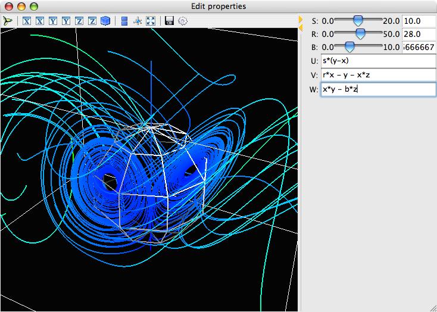

---
jupyter:
  jupytext:
    text_representation:
      extension: .md
      format_name: markdown
      format_version: '1.2'
      jupytext_version: 1.3.2
  kernelspec:
    display_name: Python 3
    language: python
    name: python3
---

<!-- #region slideshow={"slide_type": "slide"} -->
## Pythonic 3D visualization: Some useful features

**Prabhu Ramachandran and Matt McCormick**

**SciPy 2022**

<!-- #endregion -->

<!-- #region slideshow={"slide_type": "slide"} -->
## Useful features

- Powerful and convenient UI
- Script recording for automation
- Building custom UIs and dialogs
- Notebook support (server-side and client-side)

<!-- #endregion -->

<!-- #region slideshow={"slide_type": "slide"} -->
## Demo of script recording

<!-- #endregion -->

<!-- #region slideshow={"slide_type": "slide"} -->
## Custom UIs

<!-- #endregion -->

<!-- #region slideshow={"slide_type": "slide"} -->
## Custom UIs

- 130 loc for the UI
- Uses traits/traitsui
- Declarative UI
- See ETS tutorial this afternoon

<!-- #endregion -->

<!-- #region slideshow={"slide_type": "slide"} -->
## Notebook support

- Both server-side and client side possible
- Use `mlab.init_notebook`
- Different backends: `'ipy'` or `'itk'`

<!-- #endregion -->
