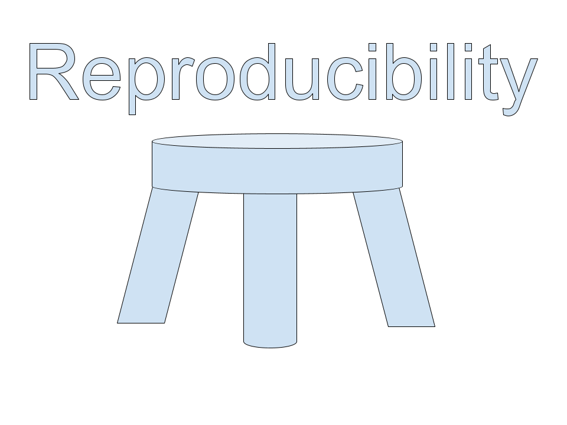
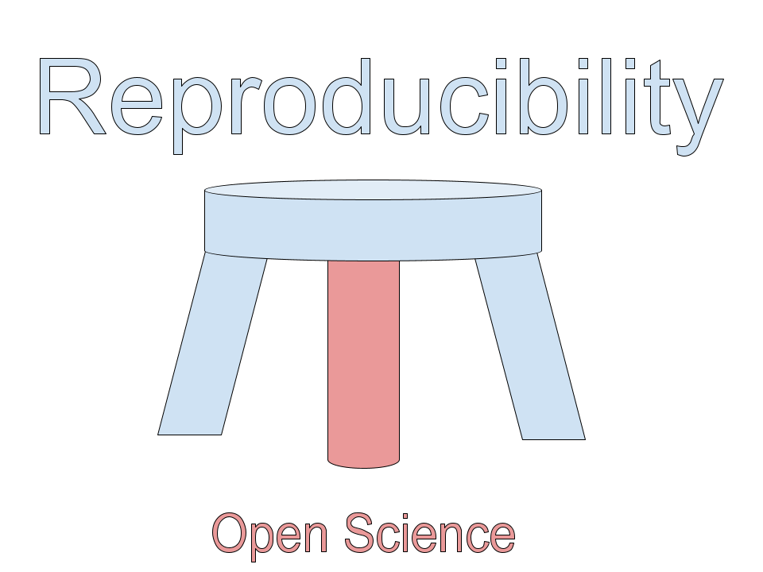
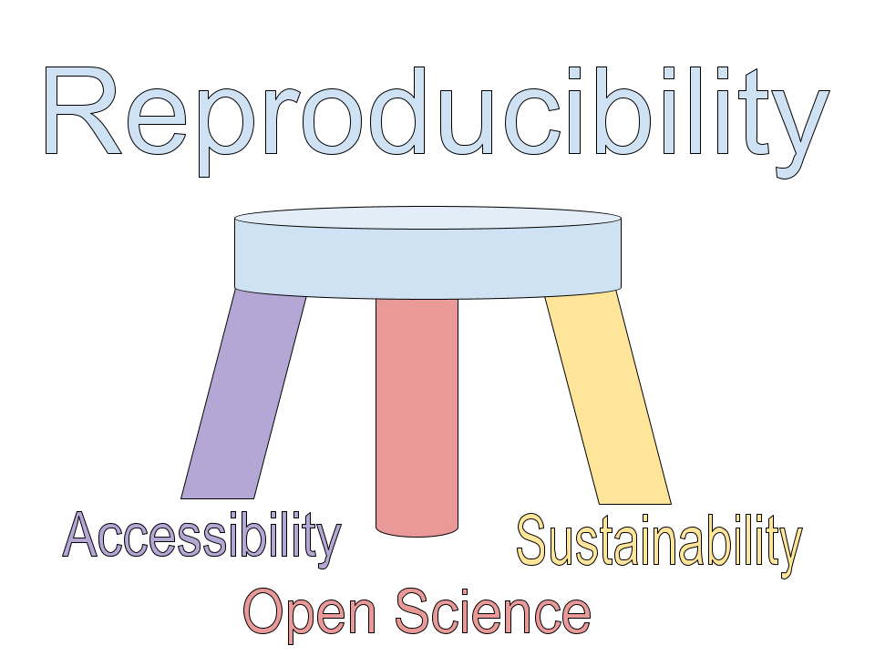
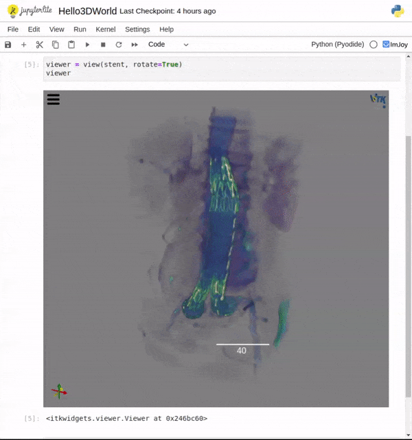

---
jupyter:
  jupytext:
    text_representation:
      extension: .md
      format_name: markdown
      format_version: '1.3'
      jupytext_version: 1.14.0
  kernelspec:
    display_name: Python 3 (ipykernel)
    language: python
    name: python3
---

<!-- #region slideshow={"slide_type": "slide"} -->
## Pythonic 3D visualization: Some useful features

### Part 2

**Prabhu Ramachandran and Matt McCormick**

**SciPy 2022**

<!-- #endregion -->

<!-- #region slideshow={"slide_type": "slide"} -->
## Outline

- **`itkwidgets` noteboook backend for `mayavi`** $\Longleftarrow$

- `itkwidgets` on *JupyterLite*

- *TensorBoard* and deep learning

<!-- #endregion -->

<!-- #region slideshow={"slide_type": "slide"} -->
### Mayavi on Jupyter

Use either the `'ipy'` or `'itk'` backends.  The `'ipy'` mode also relies on off-screen support but is the default and most powerful of the options.  It also does not require WebGL support in your browser.

For the default `'ipy'` backend, one also requires to have `ipywidgets` and `ipyevents` installed.

The `'itk'` backend is entirely client-side, and requires that you have `'itkwidgets'` installed.
<!-- #endregion -->

```python slideshow={"slide_type": "slide"}
# Always start with this.
from mayavi import mlab
mlab.init_notebook()
```

```python slideshow={"slide_type": "slide"}
s = mlab.test_contour3d()
scp = mlab.pipeline.scalar_cut_plane(s)
s.module_manager.scalar_lut_manager.show_scalar_bar = True
s
```

<!-- #region slideshow={"slide_type": "fragment"} -->
Note that if all goes well, you should be able to interact with the above just as you would with a typical Mayavi UI widget.  You should be able to interact with the camera, with the cut plane widget and with the scalar bar.|
<!-- #endregion -->

<!-- #region slideshow={"slide_type": "slide"} -->
Note that you will need to create a new figure if you want a different visualization.  In the following we show the same figure as above, note that interacting with one will automatically update the other as they are the same figure.
<!-- #endregion -->

```python slideshow={"slide_type": "fragment"}
mlab.gcf()
```

<!-- #region slideshow={"slide_type": "fragment"} -->
Note that unlike the other backends, if you call `mlab.clf()`, it will clear all the widgets for that particular figure -- since they are all the same.
<!-- #endregion -->

<!-- #region slideshow={"slide_type": "slide"} -->
### itk backend

When initializing the notebook, use the itk backend.
<!-- #endregion -->

```python slideshow={"slide_type": "fragment"}
mlab.init_notebook('itk')
```

```python slideshow={"slide_type": "slide"}
mlab.figure()
# Note the use of the figure here to create a new visualization.
s = mlab.test_points3d()
s
```

```python slideshow={"slide_type": "slide"}
mlab.clf()
mlab.test_contour_surf()
```

```python slideshow={"slide_type": "slide"}
mlab.clf()
s = mlab.test_mesh_sphere()
s
```

```python slideshow={"slide_type": "slide"}
mlab.clf()
mlab.test_contour3d()
```

<!-- #region slideshow={"slide_type": "slide"} -->
## Outline

- `itkwidgets` noteboook backend for `mayavi`

- **`itkwidgets` on *JupyterLite*** $\Longleftarrow$

- *TensorBoard* and deep learning

<!-- #endregion -->

<!-- #region slideshow={"slide_type": "slide"} -->
### JupyterLite


[JupyterLite](https://jupyterlite.readthedocs.io/en/latest/) is a JupyterLab distribution that **runs entirely in the browser** built from the ground-up using JupyterLab components and extensions.
<!-- #endregion -->

<!-- #region slideshow={"slide_type": "slide"} -->


Example kernels that can be run in JupyterLite:
    
- [p5.js](https://p5js.org/): *a JavaScript library for creative coding, with a focus on making coding accessible and inclusive for artists, designers, educators, beginners, and anyone else!*
- JavaScript: a basic JavaScript kernel
- [Pyodide](https://pyodide.org/en/stable/): Pyodide is a Python distribution for the browser and Node.js based on WebAssembly
- [xeus-python](https://github.com/jupyterlite/xeus-python-kernel): The xeus-python Python kernel for JupyterLite running in the browser
<!-- #endregion -->

<!-- #region slideshow={"slide_type": "slide"} -->
### Reproducibility Three-legged Stool



We can think of **reproducibility**, the **core of the scientific method**, as a *three-legged stool* held up by equally important legs.
<!-- #endregion -->

<!-- #region slideshow={"slide_type": "slide"} -->
### Reproducibility Three-legged Stool - Open Science



One of those legs is **Open Science**, the availability of:

- Code
- Data
- Narratives
<!-- #endregion -->

<!-- #region slideshow={"slide_type": "slide"} -->
### Reproducibility Three-legged Stool - Accessibility, Sustainability



However, equality important legs are:
<!-- #endregion -->

<!-- #region slideshow={"slide_type": "fragment"} -->
#### Accessibility

- Is the code written in an easy-to-understand language, like **Python**?
- Is the data in an **open standard format** that can be easily parsed?
- Is possible to access the **compute environment dependencies**?
<!-- #endregion -->

<!-- #region slideshow={"slide_type": "slide"} -->
### Reproducibility Three-legged Stool - Accessibility, Sustainability


However, equality important legs are:
<!-- #endregion -->

<!-- #region slideshow={"slide_type": "fragment"} -->
#### Sustainability

- Will the data, code, compute environment be available for a **long period of time**?
- Does reproducibilty require **minimal resources**?
<!-- #endregion -->

<!-- #region slideshow={"slide_type": "slide"} -->
### Try itkwidgets with JupyterLite!

Available in the itkwidgets-1.X pre-release.

<a href="https://itkwidgets.readthedocs.io/en/latest/_static/retro/notebooks/?path=Hello3DWorld.ipynb" target="_blank">



</a>
<!-- #endregion -->

<!-- #region slideshow={"slide_type": "slide"} -->
### Exercise: Save the notebook and a file and reload the page

- Do the changes persist?
- Where are they stored?
<!-- #endregion -->

<!-- #region slideshow={"slide_type": "slide"} -->
## Outline

- `itkwidgets` noteboook backend for `mayavi`

- `itkwidgets` on *JupyterLite*

- ***TensorBoard* and deep learning** $\Longleftarrow$

<!-- #endregion -->

<!-- #region slideshow={"slide_type": "slide"} -->
### TensorBoardPlugin3D - 3D Tensor Visualization


**TensorBoardPlugin3D** is an open-source *TensorBoard* plugin that supports
visualizing 3D output within the TensorBoard application, JupyterLab,
Google Colab, and SageMaker.

TensorBoardPlugin3D is built on the same technology as itkwidgets. However, the tool is targetted towards **training deep learning neural networks** with *tensorflow* or *pytorch*, for example.
<!-- #endregion -->

<!-- #region slideshow={"slide_type": "slide"} -->
Install the [PyPI package](https://pypi.python.org/pypi/tensorboard-plugin-3d) with:

```sh
pip install tensorboard-plugin-3d
```
<!-- #endregion -->

<!-- #region slideshow={"slide_type": "slide"} -->
## MONAI examples


### Medical Open Network for Artificial Intelligence

The Spleen Segmentation 3D tutorial shows how to integrate [MONAI](https://monai.io/) into an existing PyTorch medical DL program and demonstrates using TensorBoardPlugin3D to view an image with a label to show the input data (shown in the first image) or to compare the model output with the input.

[](https://colab.research.google.com/github/KitwareMedical/tensorboard-plugin-3d/blob/main/demo/notebook/cached_spleen_segmentation_3d.ipynb)

<!-- #endregion -->

<!-- #region slideshow={"slide_type": "slide"} -->
## MONAI examples


### Medical Open Network for Artificial Intelligence

The Spleen Segmentation 3D tutorial shows how to integrate [MONAI](https://monai.io/) into an existing PyTorch medical DL program and demonstrates using TensorBoardPlugin3D to view an image with a label to show the input data (shown in the first image) or to compare the model output with the input.

[](https://colab.research.google.com/github/KitwareMedical/tensorboard-plugin-3d/blob/main/demo/notebook/cached_spleen_segmentation_3d.ipynb)

<!-- #endregion -->

<!-- #region slideshow={"slide_type": "slide"} -->
## MONAI examples


### Medical Open Network for Artificial Intelligence
The UNet Segmentation 3D Ignite notebook provides a simple, fast-running notebook with demo data. If you're looking for a quick way to get started and see the plugin in action this is a great place to start. [](https://colab.research.google.com/github/KitwareMedical/tensorboard-plugin-3d/blob/main/demo/notebook/unet_segmentation_3d_ignite.ipynb)

<!-- #endregion -->

<!-- #region slideshow={"slide_type": "slide"} -->
See the [tensorboard-plugin-3d documentation](https://tensorboardplugin3d.readthedocs.io/en/latest/)
for a guide on getting started.
<!-- #endregion -->
