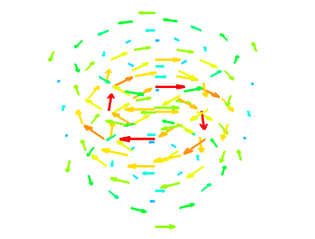
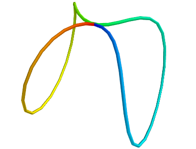
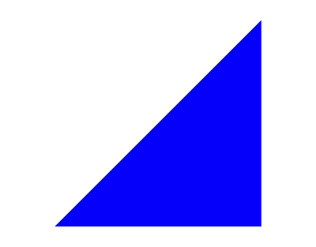

---
jupyter:
  jupytext:
    text_representation:
      extension: .md
      format_name: markdown
      format_version: '1.3'
      jupytext_version: 1.14.0
  kernelspec:
    display_name: Python 3 (ipykernel)
    language: python
    name: python3
---

<!-- #region slideshow={"slide_type": "slide"} -->
## Pythonic 3D visualization: Introduction to datasets

**Prabhu Ramachandran and Matt McCormick**

**SciPy 2022**

<!-- #endregion -->

<!-- #region slideshow={"slide_type": "slide"} -->
## Outline

- **Datasets background**  $\Longleftarrow$

- Creating datasets from Python

<!-- #endregion -->

<!-- #region slideshow={"slide_type": "slide"} -->
## Datasets: Why the fuss?

* 3D data requires more information than in 2D

* Topology is important

* 2D is a lot easier

<!-- #endregion -->


<!-- #region slideshow={"slide_type": "slide"} -->
## Dimensionality example

| |  |
| ---------------- | --------------|
| Points           |  Wireframe    |
| | |
| Surface          |               |

<!-- #endregion -->

<!-- #region slideshow={"slide_type": "slide"} -->
## Discretization of the space

- Discretize the space

- Points in the space

- Simplices that break up the space

- Data values at each point/simplex to describe a field

<!-- #endregion -->


<!-- #region slideshow={"slide_type": "slide"} -->
## Topology and Grids

* "Topology": how are points of the space connected up to
  form a line/surface/volume

* *Grid* in scientific computing: points + topology

* Space broken into small "pieces" called
    * Cells
    * Elements

* Data can be associated with the points or cells

<!-- #endregion -->

<!-- #region slideshow={"slide_type": "slide"} -->
## The general idea

* Specify points of the space

* Specify connectivity between points (topology)

* Connectivity creates "cells"

* Specify "attribute" data at points or cells

<center>

</center>

<!-- #endregion -->

<!-- #region slideshow={"slide_type": "slide"} -->
## Types of datasets

* Implicit topology (structured):
   * Image data (structured points)
   * Rectilinear grids
   * Structured grids

* Explicit topology (unstructured):
   * Polygonal data (surfaces)
   * Unstructured grids

<!-- #endregion -->

<!-- #region slideshow={"slide_type": "slide"} -->
## Structured versus unstructured grids

* Important to understand the differences

* Differences related to topology specification

* Recall the `mlab` data sources?
   * Unconnected
   * Implicit connectivity
   * Explicit connectivity

<!-- #endregion -->

<!-- #region slideshow={"slide_type": "slide"} -->
## Unconnected sources

| `scalar_scatter` | `vector_scatter` |
| ---------------- | ---------------- |
|  |  |
|`PolyData`      | `PolyData`    |
|`mlab.points3d`   | `mlab.quiver3d` |

<!-- #endregion -->

<!-- #region slideshow={"slide_type": "slide"} -->
## Implicitly-connected sources

| `scalar_field`    |   `vector_field`  |
| ----------------- | ---------------   |
|  |  |
| `ImageData`       | `ImageData`     |
| `mlab.contour3d`  | `mlab.flow`     |

<!-- #endregion -->

<!-- #region slideshow={"slide_type": "slide"} -->
## Implicitly-connected sources

`array2d_source`


`ImageData`

`mlab.imshow`

<!-- #endregion -->

<!-- #region slideshow={"slide_type": "slide"} -->
## Explicitly-connected sources

| `line_source`  | `triangular_mesh_source` |
| -------------- | ---------------------- |
|  |   |
|`PolyData`      | `PolyData`    |
|`mlab.plot3d`   | `mlab.triangular_mesh` |

<!-- #endregion -->

<!-- #region slideshow={"slide_type": "slide"} -->
## Structured grids

* Implicit topology associated with points
* Easiest example: a rectangular mesh
* Non-rectangular mesh certainly possible


| | |
| ------ | ------- |

<!-- #endregion -->

<!-- #region slideshow={"slide_type": "slide"} -->
## Unstructured grids

* Explicit topology specification

* Specified via connectivity lists

* Different number of neighbors, different types of cells


<!-- #endregion -->

<!-- #region slideshow={"slide_type": "slide"} -->
## Different types of cells


<!-- #endregion -->

<!-- #region slideshow={"slide_type": "slide"} -->
## Scalar, vector and tensor fields

* Associate a scalar/vector/tensor with every point of the space

* Scalar field: $ f(\mathcal{R}^n) \rightarrow \mathcal{R}$
* Vector field: $ f(\mathcal{R}^n) \rightarrow \mathcal{R}^m$
* Some examples:
    * Temperature distribution on a rod
    * Pressure distribution in room
    * Velocity field in room
    * Vorticity field in room
    * Stress tensor field on a surface

* Two aspects of field data, representation and visualization

<!-- #endregion -->

<!-- #region slideshow={"slide_type": "slide"} -->
## A note on Cell Data

* Most algorithms work with point data

* Convert to point data: `CellDataToPointData`

<!-- #endregion -->

<!-- #region slideshow={"slide_type": "slide"} -->
## Exercise
<center>

</center>

<!-- #endregion -->

<!-- #region slideshow={"slide_type": "slide"} -->
## Exercise
<center>

</center>

<!-- #endregion -->

<!-- #region slideshow={"slide_type": "slide"} -->
## Exercise
<center>

</center>

<!-- #endregion -->

<!-- #region slideshow={"slide_type": "slide"} -->
## Exercise
<center>

</center>

<!-- #endregion -->

<!-- #region slideshow={"slide_type": "slide"} -->
## Exercise
<center>

</center>

<!-- #endregion -->


<!-- #region slideshow={"slide_type": "slide"} -->
## VTK datasets

* These are the most fundamental

* VTK data files support the following:
  1. Image data (earlier called Structured Points)
  1. Rectilinear grid
  1. Structured grid
  1. Unstructured grid
  1. Polygonal data

<!-- #endregion -->

<!-- #region slideshow={"slide_type": "slide"} -->
## The different datasets

- Implicitly connected datasets

   - Structured points/Image data: fixed spacing, orthogonal
   - Rectilinear grid: spacing variable but orthogonal coordinates
   - Structured grids: mappable to a meshgrid

- Explicitly connected

   - Polygonal data: surfaces
   - Unstructured grid: volumes/surfaces

<!-- #endregion -->

<!-- #region slideshow={"slide_type": "slide"} -->
## Implicit ordering

* Important: Implicit ordering of points and cells.
  The $X$ co-ordinate increases first, $Y$ next and $Z$ last.

<!-- #endregion -->

<!-- #region slideshow={"slide_type": "slide"} -->
## VTK data files

- VTK has a native data format: `*.vtk`, `*.vt*`
- Detailed documentation on this is available here: [www.vtk.org/VTK/img/file-formats.pdf](https://www.vtk.org/VTK/img/file-formats.pdf)
- Can be created and loaded easily

<!-- #endregion -->


<!-- #region slideshow={"slide_type": "slide"} -->
## Loading data with `mlab`

This will open all supported files:

<!-- #endregion -->

```python
import numpy as np
from mayavi import mlab
```

```python
%gui qt
```
OR do this

```python
mlab.init_notebook('itk')
```


```python
mlab.pipeline.open('data/room_vis.wrl')
```

```python
mlab.pipeline.open('data/fire_ug.vtu')
```

<!-- #region slideshow={"slide_type": "slide"} -->
## Outline

- Datasets background

- **Creating datasets from Python**  $\Longleftarrow$

<!-- #endregion -->

<!-- #region slideshow={"slide_type": "slide"} -->
## Overview

* Create datasets with TVTK and NumPy

* Simple examples

* Very handy when working with NumPy

* No need to create VTK data files!

* `PolyData`, `ImageData`, `StructuredGrid` , `UnstructuredGrid`

<!-- #endregion -->

<!-- #region slideshow={"slide_type": "slide"} -->
## Overview

* Using `tvtk`  in the following

* `tvtk`  uses VTK underneath

* Much easier to use than raw VTK

<!-- #endregion -->

```python
from tvtk.api import tvtk
```

<!-- #region slideshow={"slide_type": "slide"} -->
## Image data: 2D

<!-- #endregion -->

```python slideshow={"slide_type": "fragment"}
# The scalar values.
x, y = np.mgrid[-10:10:51j, -10:10:51j]
r = np.sqrt(x**2 + y**2)
z = 2.0*np.sin(r)  # Bessel function of order 0
```

```python
# Can't specify explicit points, they are implicit.
# The volume specified using origin, spacing and dims.
from tvtk.api import tvtk
spoints = tvtk.ImageData(origin=(-10, -10, 0), spacing=(0.4, 0.4, 1),
                         dimensions=(51, 51, 1))
```

```python slideshow={"slide_type": "fragment"}
# Transpose array data due to VTK's implicit ordering.
# ravel it so the number of components is 1.
spoints.point_data.scalars = z.T.ravel()
spoints.point_data.scalars.name = 'scalar'
```

<!-- #region slideshow={"slide_type": "slide"} -->
## Visualizing it

<!-- #endregion -->

```python
mlab.clf()
# Add the dataset to the pipeline
src = mlab.pipeline.add_dataset(spoints)

warp = mlab.pipeline.warp_scalar(src)
surf = mlab.pipeline.surface(warp)
surf
```


<!-- #region slideshow={"slide_type": "slide"} -->
## Image data: 3D

<!-- #endregion -->

```python
x, y, z = np.mgrid[-5:5:128j,-5:5:128j,
                   -5:5:128j]
scalars = np.sin(x*y*z)/(x*y*z)
```

```python
spoints = tvtk.ImageData(
    origin=(-5.,-5,-5),
    spacing=(10./127,10./127,10./127),
    dimensions=(128,128,128)
)
```

```python
# The copy makes the data contiguous and the transpose
# makes it suitable for display via tvtk.
s = scalars.transpose().copy()
spoints.point_data.scalars = s.ravel()
spoints.point_data.scalars.name = 'scalars'
```

<!-- #region slideshow={"slide_type": "slide"} -->
## Visualizing it

<!-- #endregion -->

```python
mlab.clf()
# Add the dataset to the pipeline
src = mlab.pipeline.add_dataset(spoints)

cut = mlab.pipeline.scalar_cut_plane(src)
contour = mlab.pipeline.iso_surface(src)
contour
```


<!-- #region slideshow={"slide_type": "slide"} -->
## Changing the data

- Change the `s` array directly!

<!-- #endregion -->

```python
s[:64, ...] = (np.sin(x)/(x+ y+ z))[:64, ...]
src.data_changed = True
```

```python
contour
```

<!-- #region slideshow={"slide_type": "slide"} -->
## Adding more attributes

- Note: `add_attribute` clobbers existing array with same name

<!-- #endregion -->

```python
src.add_attribute(array, 'name', category='point')
# See also:
src.remove_attribute(name, category='point')
src.rename_attribute(from_name, to_name, category='point')
```

<!-- #region slideshow={"slide_type": "slide"} -->
## Structured Grid

<!-- #endregion -->

```python
r, th, z = np.mgrid[1:10:25j, 0:2*np.pi:51j, 0:5:25j]
x, y = np.cos(th)*r, np.sin(th)*r
scalar = x*x + y*y + z*z
```

```python
pts = np.empty(z.shape + (3,))
pts[...,0] = x
pts[...,1] = y
pts[...,2] = z
```

```python
pts = pts.transpose(2, 1, 0, 3).copy()
pts.shape = pts.size//3, 3
```

```python slideshow={"slide_type": "fragment"}
sgrid = tvtk.StructuredGrid(dimensions=x.shape)
sgrid.points = pts
sgrid.point_data.scalars = np.ravel(scalar.T.copy())
sgrid.point_data.scalars.name = 'scalars'
```

<!-- #region slideshow={"slide_type": "slide"} -->
## Visualizing it

<!-- #endregion -->

```python
mlab.clf()
# Add the dataset to the pipeline
src = mlab.pipeline.add_dataset(sgrid)

plane = mlab.pipeline.grid_plane(src)
plane.grid_plane.axis = 'z'
c_plane = mlab.pipeline.contour_grid_plane(src)
c_plane.enable_contours = False

iso = mlab.pipeline.iso_surface(src)
iso
```


<!-- #region slideshow={"slide_type": "slide"} -->
## PolyData

<!-- #endregion -->

```python
# The points in 3D.
points = np.array([[0.,0,0], [1,0,0], [0,1,0], [0,0,1]])
# Connectivity via indices to the points.
triangles = np.array([[0,1,3], [0,3,2], [1,2,3], [0,2,1]])
# Creating the data object.
```

```python slideshow={"slide_type": "fragment"}
mesh = tvtk.PolyData()
mesh.points = points # the points
mesh.polys = triangles # triangles for connectivity.
# For lines/verts: mesh.lines = lines; mesh.verts = verts
```

```python
# Now create some point data.
temperature = np.array([10., 20. ,30., 40.], 'f')
mesh.point_data.scalars = temperature
mesh.point_data.scalars.name = 'temperature'
```

```python
# Some vectors.
velocity = np.array([[0.,0.,0], [1.,0,0], [0.,1,0], [0.,0,1]])
mesh.point_data.vectors = velocity
mesh.point_data.vectors.name = 'velocity'
```

<!-- #region slideshow={"slide_type": "slide"} -->
## Visualizing it

<!-- #endregion -->

```python
mlab.clf()
src = mlab.pipeline.add_dataset(mesh)

surf = mlab.pipeline.surface(src)
vec = mlab.pipeline.vectors(src)
vec
```


<!-- #region slideshow={"slide_type": "slide"} -->
## Unstructured Grid

<!-- #endregion -->

```python
points = np.array([[0.,0.,0], [1.,0,0], [0.,1,0], [0.,0,1]])
tets = np.array([[0, 1, 2, 3]])
tet_type = tvtk.Tetra().cell_type # VTK_TETRA == 10
```

```python
ug = tvtk.UnstructuredGrid(points=points)
# This sets up the cells.
ug.set_cells(tet_type, tets)
```

```python
# Attribute data.
temperature = np.array([10, 20 ,20, 30], 'f')
ug.point_data.scalars = temperature
ug.point_data.scalars.name = 'temperature'
# Some vectors.
velocity = np.array([[0.,0,0], [1,0,0], [0,1,0], [0,0,1]])
ug.point_data.vectors = velocity
ug.point_data.vectors.name = 'velocity'
```

<!-- #region slideshow={"slide_type": "slide"} -->
## Visualizing it

<!-- #endregion -->

```python
mlab.clf()
# Add the dataset to the pipeline
src = mlab.pipeline.add_dataset(ug)

surf = mlab.pipeline.surface(src)
vec = mlab.pipeline.vectors(src)
vec
```


<!-- #region slideshow={"slide_type": "slide"} -->
## Saving data to file

* Use `tvtk.api.write_data`
* Automatically picks a writer

<!-- #endregion -->

```python
from tvtk.api import write_data
write_data(ug, '/tmp/ug.vtu')
write_data(ug, '/tmp/ug.vtk')
```
